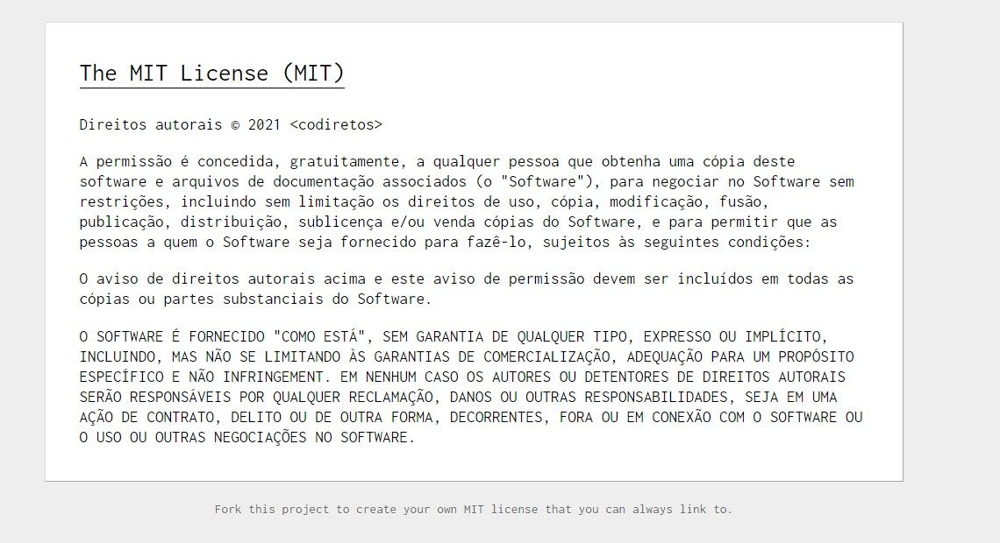
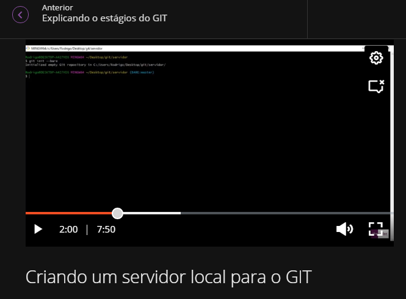

<h1> 1 - Programming Challenge </h1>

## Nome: Franciane Lark 
## Data: 30-08-2021

<!-- -------------------------------------------------------------------------------------------------------------------------------- -->

<h2> - Licenciamento do projeto MIT </h2>

- MIT License ( mit-license.org )

 
  

 

<!-- -------------------------------------------------------------------------------------------------------------------------------- -->

<h2> - Instruções da Resolução do Problema </h2>

- https://bit.ly/Challenge-FrancianeLark

 
   
<!-- -------------------------------------------------------------------------------------------------------------------------------- -->

<h2> - Github: Comandos Git </h2>

 
  

 

<!-- -------------------------------------------------------------------------------------------------------------------------------- -->