<h1> Programming Challenge </h1>

## Nome: Franciane Lark

## Data: 30-08-2021

 
<!-- -------------------------------------------------------------------------------------------------------------------------------- -->

<h2> - Licenciamento do projeto MIT. </h2>

- MIT License ( mit-license.org )

 
  

 

<!-- -------------------------------------------------------------------------------------------------------------------------------- -->

<h2> - Instruções: Resolução do Problema. </h2>

- https://bit.ly/Challenge-FrancianeLark

 
   
<!-- -------------------------------------------------------------------------------------------------------------------------------- -->

<h2> - Github: Comandos Git. </h2>

 
  

- https://voceprogramadorformacaoprofiss.club.hotmart.com/lesson/K4kqJ6jy7Y/criando-um-servidor-local-para-o-git

 

<!-- -------------------------------------------------------------------------------------------------------------------------------- -->

<h2> - React: Instalação. </h2>

 
  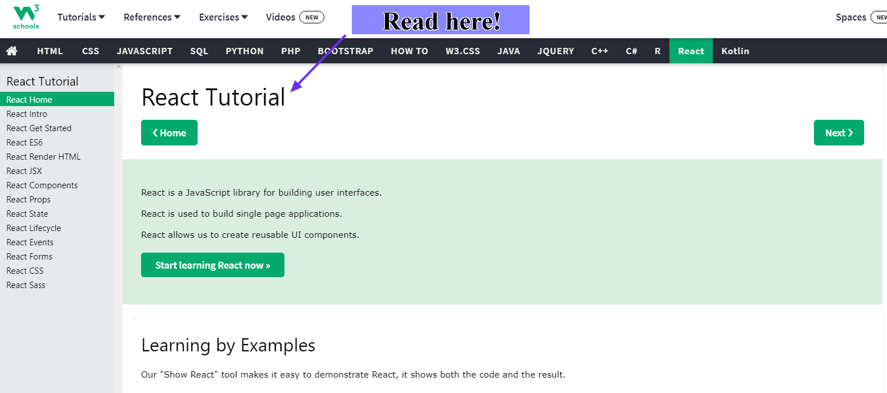

- https://www.w3schools.com/react/default.asp
   

<!-- --------Animas------------------------------------------------------------------------------------------------------------------------ -->

<h2> - React: Instalação feita durante a Palestra Samsung Ocean. </h2>

 
  

- Getting Started – React (reactjs.org).

 

<!-- -------------------------------------------------------------------------------------------------------------------------------- -->

<h2> - Site do OMDb API: Guardiões das Galaxias.  </h2>

 
  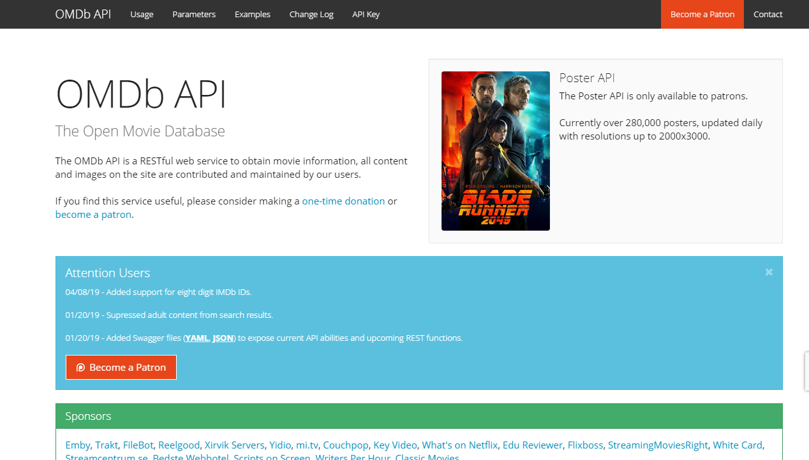

- http://www.omdbapi.com/?i=tt3896198&apikey=4ab221b7

 

<!-- -------------------------------------------------------------------------------------------------------------------------------- -->

<h2> - Chave da API: Guardiões das Galaxias. </h2>

 
  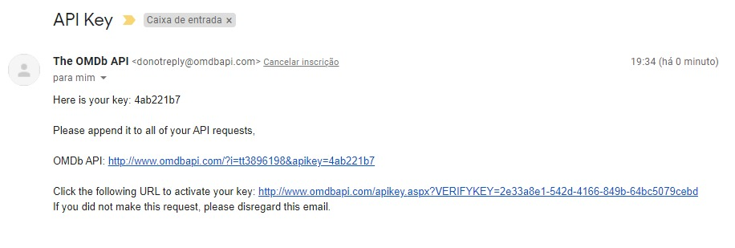

- http://www.omdbapi.com/apikey.aspx?VERIFYKEY=2e33a8e1-542d-4166-849b-64bc5079cebd

 

<!-- -------------------------------------------------------------------------------------------------------------------------------- -->

<h2> -  Folder: Comandos Git para o Github. </h2>

 
  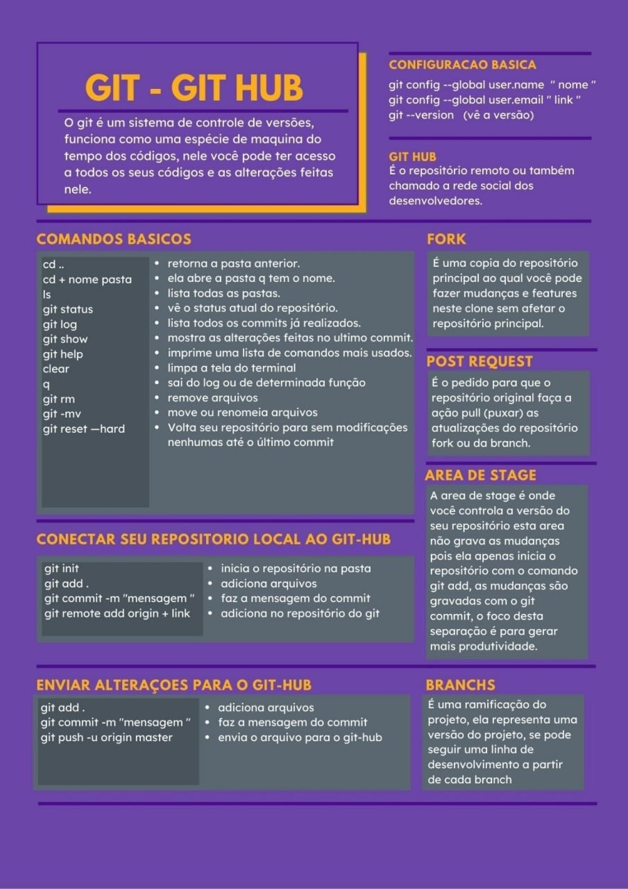

<h3>Material de Apoio:</h3>

- Comunidade Codivas.
- StackOverflow:

 
 

<!-- -------------------------------------------------------------------------------------------------------------------------------- -->

<h2> -  Xampp: Servidor Local. </h2>

 
  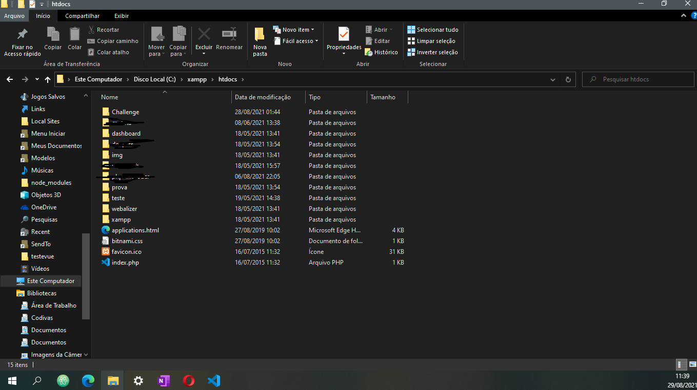

- Configuração de Servidor: Notebook Samsung Book X30. 

 

<!-- -------------------------------------------------------------------------------------------------------------------------------- -->

<h2> -  Artigo: Semântica dos Commits. </h2>

- feat: (new feature for the user, not a new feature for build script)

- fix: (bug fix for the user, not a fix to a build script)

- docs: (changes to the documentation)

- style: (formatting, missing semi colons, etc; no production code change)

- refactor: (refactoring production code, eg. renaming a variable)

- test: (adding missing tests, refactoring tests; no production code change)

- chore: (updating grunt tasks etc; no production code change)

- https://gist.github.com/joshbuchea/6f47e86d2510bce28f8e7f42ae84c716

 

<!-- -------------------------------------------------------------------------------------------------------------------------------- -->

<h2> -  Metologias Ágeis: Utilização do Scrum. </h2>

 
  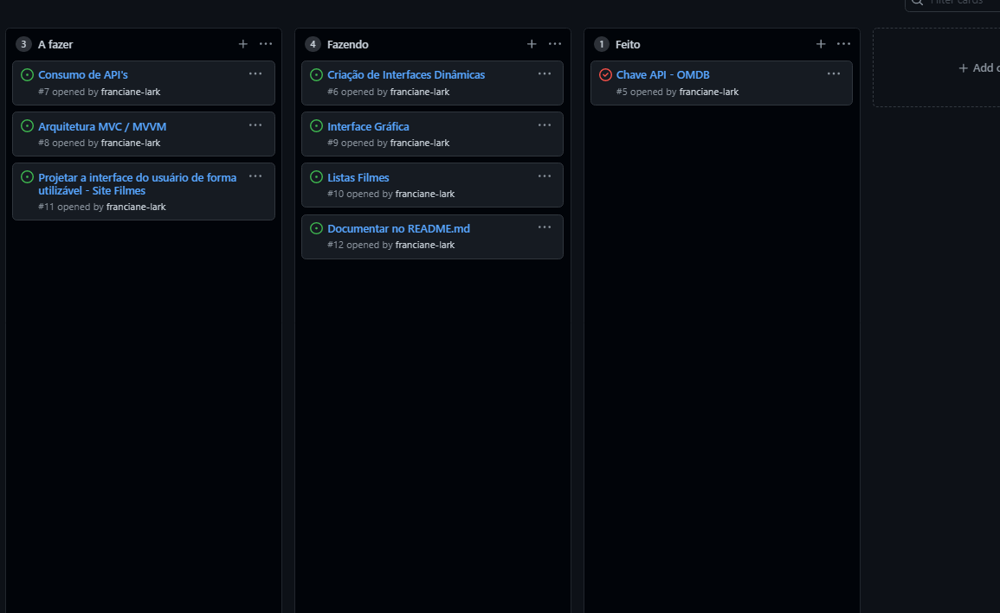

 

<!-- -------------------------------------------------------------------------------------------------------------------------------- -->

<h2> -  Teste da API: Arquitetura Rest. Parte - 1. </h2>

 
  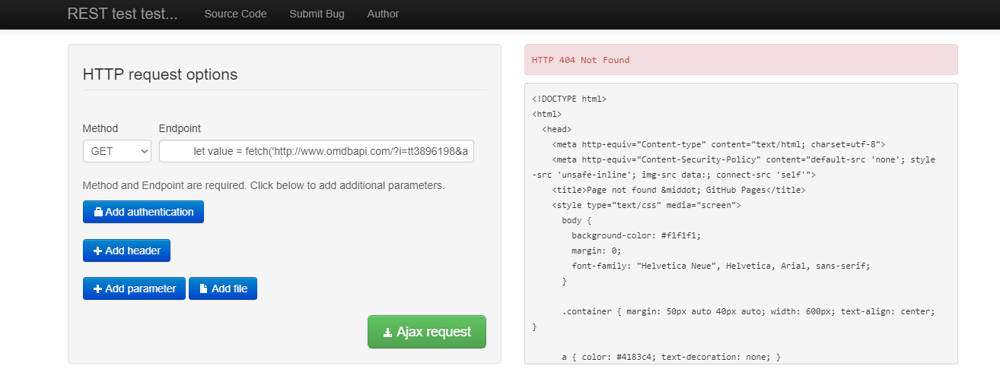

 

<!-- -------------------------------------------------------------------------------------------------------------------------------- -->

<h2> -  Teste da API: Arquitetura Rest. Parte - 2. </h2>

 
  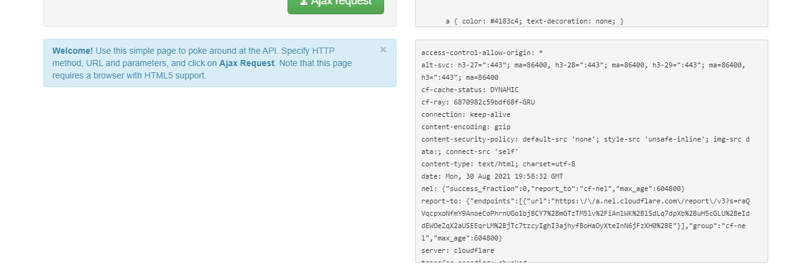

 

<!-- -------------------------------------------------------------------------------------------------------------------------------- -->

<h2> -  Teste da API: Arquitetura Rest. Parte - 3. </h2>

 
  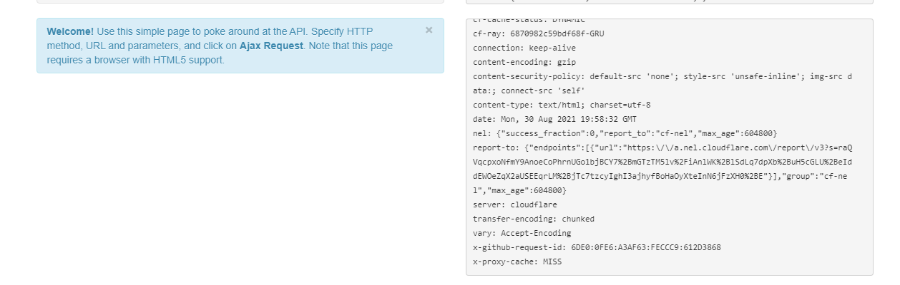

 

<!-- -------------------------------------------------------------------------------------------------------------------------------- -->

<h2> -  Descompactando a Chave: Via protocolos HTTPs. Parte 1. </h2>

 
  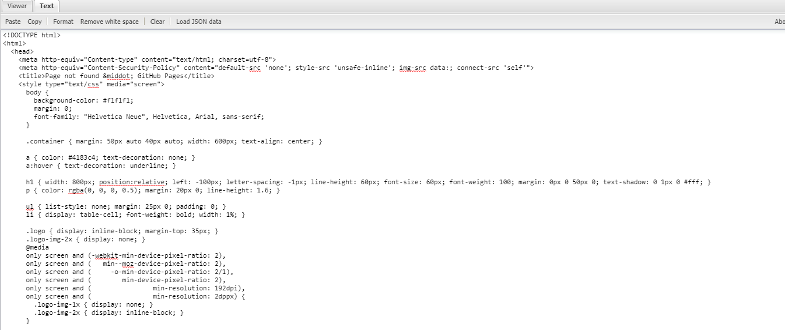

- http://jsonviewer.stack.hu/

 

<!-- -------------------------------------------------------------------------------------------------------------------------------- -->

<h2> -  Descompactando a Chave: Via protocolos HTTPs. Parte 2. </h2>

 
  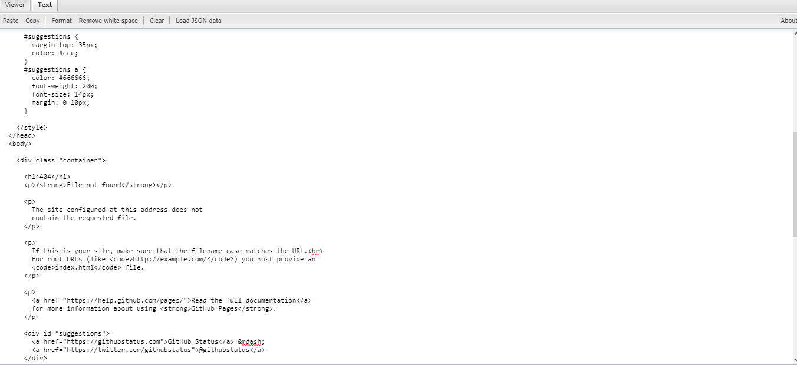

- http://jsonviewer.stack.hu/

 

<!-- -------------------------------------------------------------------------------------------------------------------------------- -->

<h2> -  Descompactando a Chave: Via protocolos HTTPs. Parte 3. </h2>

 
  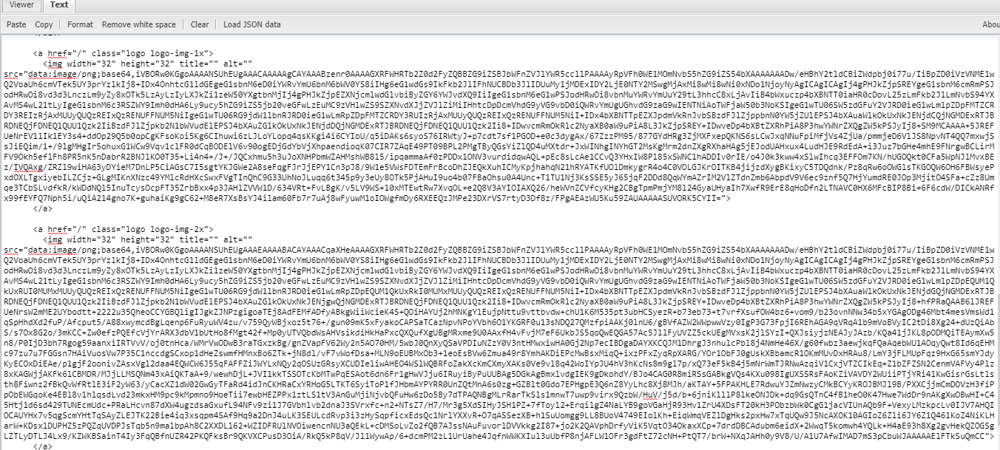

- http://jsonviewer.stack.hu/

 

<!-- -------------------------------------------------------------------------------------------------------------------------------- -->

<h2> -  Descompactando a Chave: Via protocolos HTTPs. Parte 4. </h2>

 
  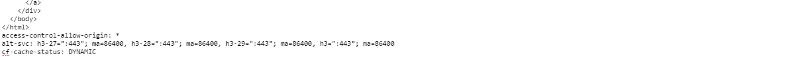

- http://jsonviewer.stack.hu/

 

<!-- -------------------------------------------------------------------------------------------------------------------------------- -->

<h2> -  Descompactando a Chave: Via protocolos HTTPs. Parte 5. </h2>

 
  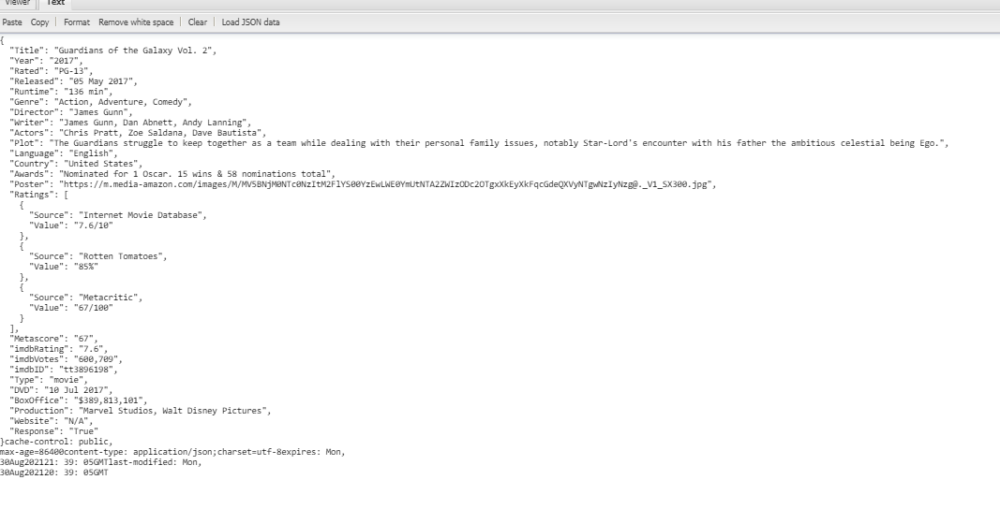

- http://jsonviewer.stack.hu/

 

<!-- -------------------------------------------------------------------------------------------------------------------------------- -->

<h2> -  Links de Referências utilizados: </h2>

- https://www.youtube.com/watch?v=tBweoUiMsDg&ab_channel=BoniekyLacerda

- https://www.youtube.com/watch?v=HJ16WEmOWTw&ab_channel=ProgramadorAlternativo

- https://www.youtube.com/watch?v=Jg6JaEjovJk&list=PLnDvRpP8BneyVA0SZ2okm-QBojomniQVO&index=4&ab_channel=MatheusBattisti-HoradeCodar

- https://www.youtube.com/watch?v=nnpMt67zsg8&list=PLZmfuCBsnqTmWI-b7R8EsD6JUA6R6eYaA&ab_channel=WebDevTV

- https://www.youtube.com/watch?v=WpdwsmNzh4g&ab_channel=WebDevTV

- https://www.youtube.com/watch?v=UR9X2VBECE4&ab_channel=WillianJustenCursos

- https://ngrok.com/

- https://sourceforge.net/

- https://create-react-app.dev/docs/deployment/#aws-amplify

- https://reactjs.org/tutorial/tutorial.html

- https://www.noip.com/pt-BR

- https://www.youtube.com/watch?v=cRHF4trs318&ab_channel=CanalTI

- https://www.youtube.com/watch?v=fI_w0XBo4ZM&ab_channel=DevMedia

- https://www.youtube.com/watch?v=cSa-SMVMGsE&ab_channel=ProgramadoraBordo

- https://www.youtube.com/watch?v=d_5iZJ8p9x8&t=1157s&ab_channel=ProgramadoraBordo

- https://webdesignemfoco.com.br/cursos/mvc-completo/mvc-mvt-e-template-engine-10-mvc-no-javascript

- https://javiani.wordpress.com/2010/12/26/o-mvc-e-o-javascript-a-teoria/

- https://www.youtube.com/watch?v=71YXm0eld8Q&ab_channel=DCodeMania

- https://www.youtube.com/watch?v=cSa-SMVMGsE&ab_channel=ProgramadoraBordo

- https://www.youtube.com/watch?v=eSM_YkWeS7k&ab_channel=1BestCsharpblog

- https://www.youtube.com/watch?v=MSiqocmCbZI&ab_channel=ExpertosTech

- https://www.youtube.com/watch?v=aV3B3n6YRPg&t=117s&ab_channel=VueScreencasts

- https://www.youtube.com/watch?v=wsAQQioPIJs&list=PLnDvRpP8BnezDglaAvtWgQXzsOmXUuRHL&ab_channel=MatheusBattisti-HoradeCodar

- https://www.themoviedb.org/documentation/api

- https://swapi.dev/documentation

- http://jsonviewer.stack.hu/

- http://resttesttest.com/

 

<!-- -------------------------------------------------------------------------------------------------------------------------------- -->
